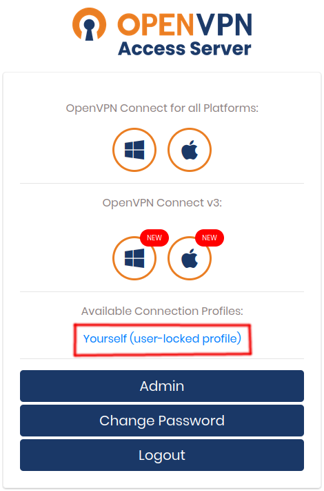

# Configurador de VPN genérico

Este script auxilia a configuração e execução dos passos básicos utilizando VPN.

# Utilizando OpenVPN via theSail

Você deve receber do administrador seu nome de usuário e senha temporários para acessar o nodo de VPN.

Por exemplo:

> User: **carlos.santanna**
> 
> Pass: **QmxhY2sgbWFnaWMgd29tYW4K** _(altere a senha assim que possível)_
> 
> URL: https://huebr-node-vpn.thesail.pro/

Com a VPN instalada utilizando os links acima de acordo com o seu dispositivo, acesse o portal da VPN através de seu navegador.

Ao acessar o portal pela primeira vez, será necessário cadastrar um dispositivo de autenticação de dois passos (2fa). Utilize o seu software atual de 2fa, como por exemplo o Google Authenticator, Yubiko otp, etc.

Após cadastrar e acessar com sucesso, clique no link Yourself (user-loked profile) para baixar as credenciais de acesso:

Salve o arquivo em sua pasta `~/.profile.ovpn`

# Configurações

Executar o script `connect.sh` testará pela existência do client do OpenVPN instalado em sua máquina, pelos arquivos `~/.profile.ovpn` e `~/.profile.secret`.
- Caso o cliente não seja encontrado você deve instalar e configurar ele como previsto para o seu sistema ou distribuição.
- O arquivo `.ovpn` deve ser obtido pelo painel da sua provedora VPN;
- O arquivo `.secret` pode ser preenchido manualmente com seu usuário e senha no formato `auth-user-pass`;
- O arquivo `.secret` pode ser preenchido automaticamente na primeira execuç~ao do `connect.sh`;